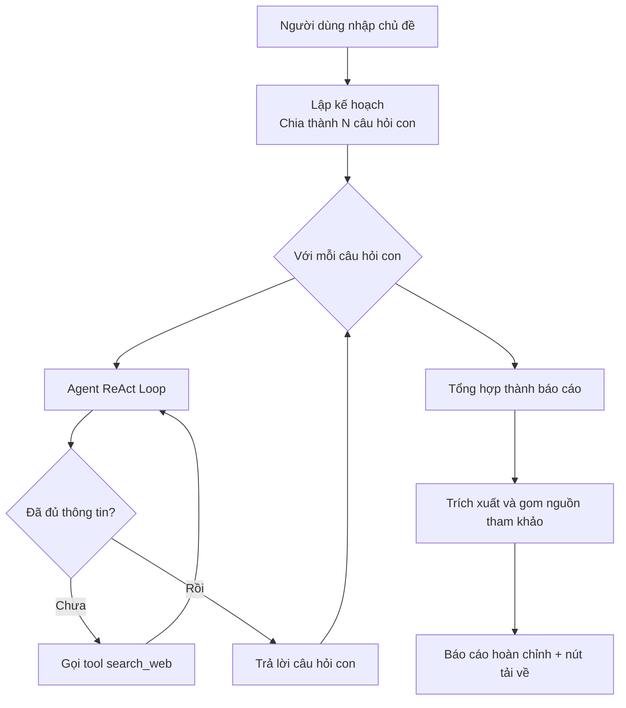

# 🔎 AI Research Agent

Agent AI tự động nghiên cứu một chủ đề bất kỳ: tự lập kế hoạch, tự tìm kiếm thông tin trên internet qua nhiều vòng lặp suy luận, và tổng hợp thành báo cáo hoàn chỉnh có trích dẫn nguồn — thay vì chỉ trả lời dựa trên "trí nhớ" có thể lỗi thời của LLM.

**🔗 Demo trực tiếp:** (https://hiep-ai-research-agent.streamlit.app/)

<!-- 💡 Gợi ý: chèn 1 ảnh chụp màn hình hoặc GIF ngắn (5-10s) quay lúc app đang chạy vào đây.
Đây là phần được nhìn NHIỀU NHẤT khi ai đó ghé repo - quan trọng hơn cả đọc code.
Cú pháp:  -->

---

## 🎯 Vấn đề giải quyết

LLM thông thường chỉ trả lời dựa trên dữ liệu đã học từ trước — không biết thông tin mới, và có thể "bịa" (hallucinate) một cách tự tin. Project này xây dựng một **AI Agent thực thụ**: có khả năng tự quyết định khi nào cần tra cứu internet, tự tìm kiếm nhiều lần cho đến khi đủ thông tin, và luôn trích dẫn nguồn rõ ràng — giúp kết quả đáng tin cậy hơn nhiều so với hỏi trực tiếp một chatbot thông thường.

## ✨ Tính năng chính

- **Lập kế hoạch tự động** — chia 1 chủ đề rộng thành các câu hỏi con cụ thể trước khi nghiên cứu
- **Vòng lặp ReAct đa bước** — agent tự quyết định số lần tìm kiếm cần thiết, không giới hạn cứng
- **Tìm kiếm web thời gian thực** — không giới hạn bởi dữ liệu training của model
- **Trích dẫn nguồn minh bạch** — mọi thông tin đều có URL kèm theo, danh sách tham khảo được trích xuất bằng code (không phó mặc cho LLM để tránh sai sót)
- **Giao diện web trực quan** — theo dõi tiến trình agent suy luận theo thời gian thực

## 🏗️ Kiến trúc hệ thống



## 🛠️ Công nghệ sử dụng

| Thành phần | Công nghệ |
|---|---|
| LLM | Gemini 2.5 Flash (Google) |
| Agent orchestration | LangChain `create_agent` |
| Tìm kiếm web | DDGS (DuckDuckGo Search) |
| Giao diện | Streamlit |
| Deploy | Streamlit Community Cloud |

## 📂 Cấu trúc project

```
research-agent/
├── app.py                    # Ứng dụng chính
├── requirements.txt
└── development-journey/      # Toàn bộ quá trình xây dựng từ số 0,
                               # từng bước một (xem bên dưới)
```

## ⚙️ Chạy thử ở local

```bash
git clone <link-repo-của-bạn>
cd research-agent
python -m venv venv
source venv/Scripts/activate   # Windows Git Bash
pip install -r requirements.txt
export GEMINI_API_KEY="your-api-key"
streamlit run app.py
```

## 📈 Hành trình phát triển

Project này được xây dựng **từ con số 0**, từng bước một, không dùng template có sẵn — thư mục [`development-journey/`](./development-journey) lưu lại đầy đủ 8 giai đoạn:

| Giai đoạn | Nội dung |
|---|---|
| 01-02 | Gọi API cơ bản, Prompt Engineering (System Prompt, Temperature) |
| 03-04 | Function Calling (cơ chế tool-use), tích hợp Web Search thật |
| 05 | Vòng lặp ReAct — agent tự quyết định số bước cần thiết |
| 06-07 | Lập kế hoạch tự động, tổng hợp báo cáo có trích dẫn |
| 08 | Refactor bằng LangChain `create_agent` — chuẩn công nghiệp |

## 🔮 Hướng phát triển tiếp theo

- [ ] Thêm bước đánh giá chất lượng (RAG/Agent evaluation) để đo độ chính xác của trích dẫn
- [ ] Cache kết quả search để giảm số lần gọi API trùng lặp
- [ ] Cho phép người dùng chỉnh số lượng câu hỏi con / độ sâu nghiên cứu
- [ ] Hỗ trợ xuất báo cáo sang PDF

---

*Xây dựng như một phần trong quá trình tự học AI/ML để chuẩn bị ứng tuyển vị trí AI/ML Intern.*
